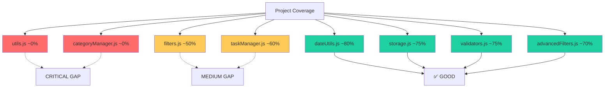
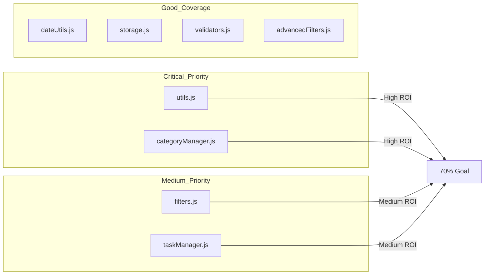
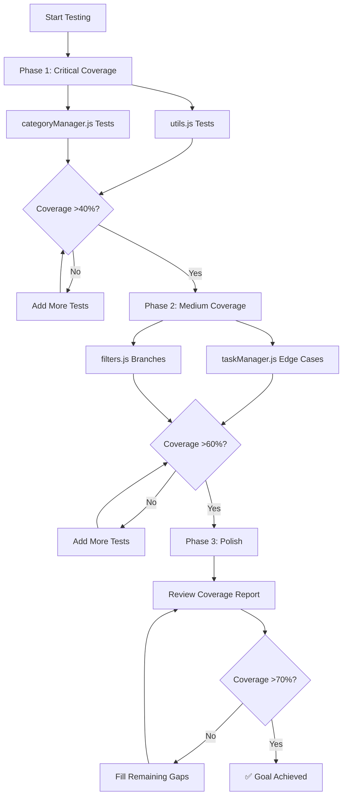
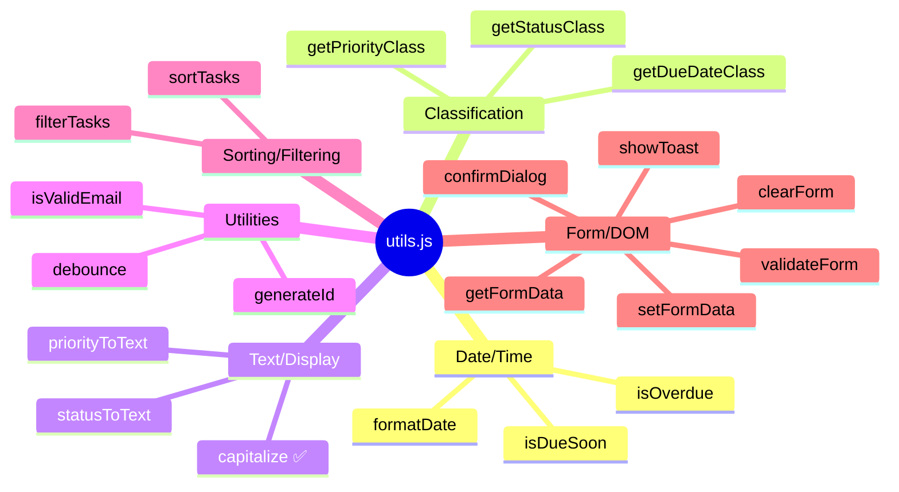
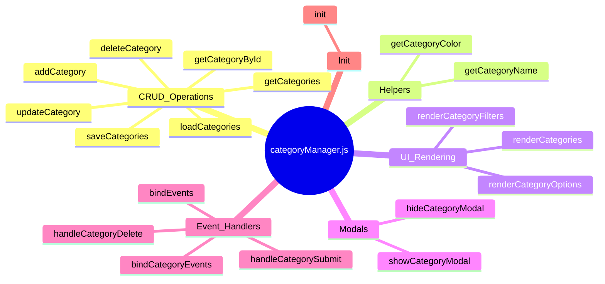
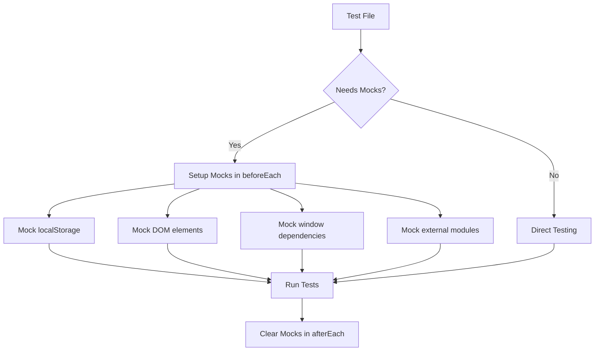
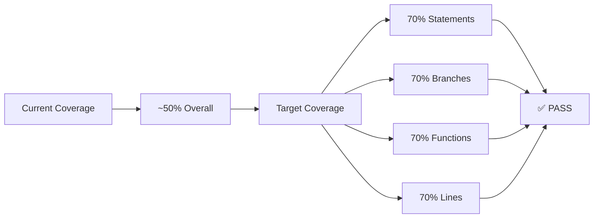

# Test Coverage Visual Analysis

## Current Coverage Overview



## Priority Matrix



## Test Implementation Flow



## utils.js Function Coverage Map



## categoryManager.js Method Coverage Map



## Impact Analysis

| File | Lines of Code | Functions | Current Coverage | Tests Needed | Impact |
|-------|---------------|------------|------------------|--------------|---------|
| utils.js | 302 | 18 | ~0% | ~50 | **HIGH** |
| categoryManager.js | 335 | 16 | ~0% | ~30 | **HIGH** |
| filters.js | 229 | 11 | ~50% | ~10 | MEDIUM |
| taskManager.js | 483 | 24 | ~60% | ~15 | MEDIUM |

## Recommended Test Order (Highest ROI First)

1. **utils.js** - 18 functions, ~50 tests needed
   - Start with date/time functions (easy to test)
   - Move to classification functions
   - Test sorting/filtering (complex but high impact)
   - Test form/DOM functions last (require more mocking)

2. **categoryManager.js** - 16 methods, ~30 tests needed
   - Start with CRUD operations (core functionality)
   - Test helper methods
   - Test UI rendering methods
   - Test event handlers last

3. **taskManager.js** - Add ~15 tests for edge cases
   - Test toggleTaskStatus transitions
   - Test partial updates
   - Test UI methods
   - Test event handlers

4. **filters.js** - Add ~10 tests for branches
   - Test all filter combinations
   - Test edge cases

## Mocking Strategy



## Success Criteria



## Quick Reference: Test Patterns

### Basic Function Test
```javascript
test('functionName does X', () => {
  const result = functionName(input);
  expect(result).toBe(expected);
});
```

### Test with Mock
```javascript
beforeEach(() => {
  mockFunction = jest.fn();
  global.window = { mockFunction };
});

test('uses mock', () => {
  // test code
  expect(mockFunction).toHaveBeenCalled();
});
```

### Test Error Cases
```javascript
test('throws error for invalid input', () => {
  expect(() => {
    functionName(invalidInput);
  }).toThrow('Error message');
});
```

### Test Multiple Scenarios
```javascript
describe('functionName', () => {
  test('scenario 1', () => { /* ... */ });
  test('scenario 2', () => { /* ... */ });
  test('scenario 3', () => { /* ... */ });
});
```
